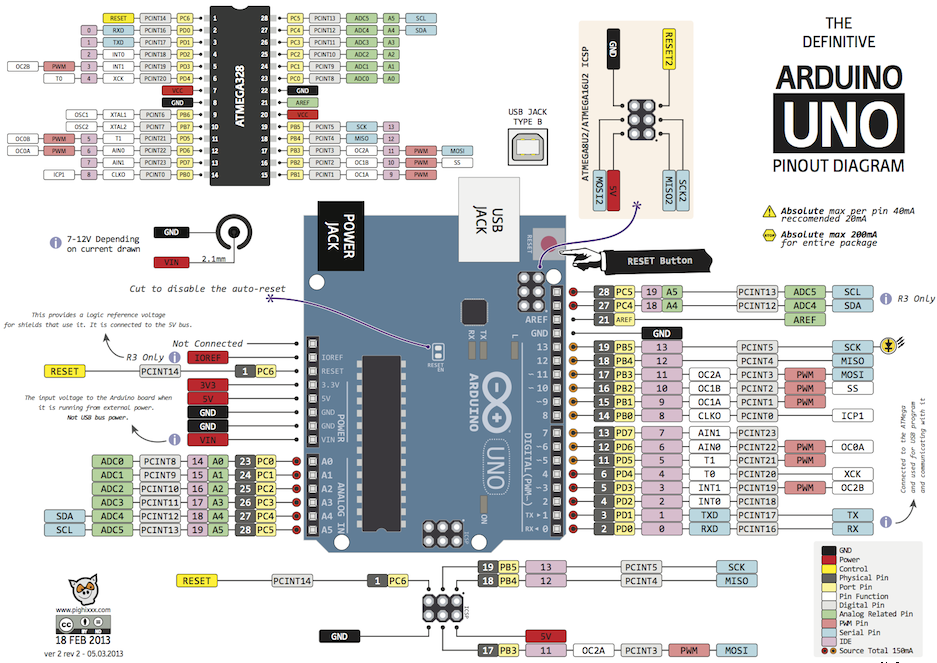

# Arduino

IC

基于C/C++

## 进本程序框架

```cpp
void setup() {
  // put your setup code here, to run once:

}

void loop() {
  // put your main code here, to run repeatedly:

}
```

`void setup()`：当开发板通电或按下复位按钮`RESET`后，执行一次。通常在`setup()`函数中完成Arduino的初始化设置，如配置I/O口状态，初始化串口等操作

`void loop()`：在`void setup()`执行后，反复执行

**C++代码**

```cpp
int main( void )
{
    init();
    
    initVariant();
    
#if defined(USBCON)
    USBDevice.attach();
#endif
    
    setup();
    
    for(;;)
    {
        loop();
        if (serialEventRun) serialEventRun();
    }
    
    return 0;
}
```

Blink

```cpp
/*
  Blink

  Turns an LED on for one second, then off for one second, repeatedly.
*/
// the setup function runs once when you press reset or power the board
void setup() {
  // initialize digital pin LED_BUILTIN as an output.
  pinMode(LED_BUILTIN, OUTPUT);
}

// the loop function runs over and over again forever
void loop() {
  digitalWrite(LED_BUILTIN, HIGH);   // turn the LED on (HIGH is the voltage level)
  delay(1000);                       // wait for a second
  digitalWrite(LED_BUILTIN, LOW);    // turn the LED off by making the voltage LOW
  delay(1000);                       // wait for a second
}
```

## 端口




**数字端口 0~13**

0 LOW：GND

1 HIGH：5V

- 13 ->LED
- 0~1 串口

**模拟端口 A0~A5**

10bits	0(GND)~1023(5V)


亮灯（放光二极管+220$\Omega$电阻）

```cpp
void setup() {
  pinMode(8,OUTPUT);	//设置为允许输出的最大电流
}

void loop() {
  digitalWrite(8,HIGH);
  delay(100);
  digitalWrite(8,LOW);
  delay(100);
}
```

`loop()`内可以简化为

```cpp
digitalWrite(8,!digitalRead(8));
delay(1000);
```

## 生命周期`millis()`

Arduino UNO 单次最大生命周期为49亿ms，超过这个时间会内存溢出，计数归零

## I^2^C(Inter-Integrated Circuit)

`SCL/A5` & `SDA/A4`

