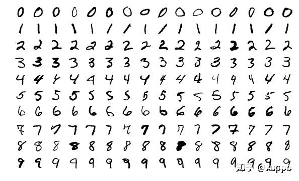
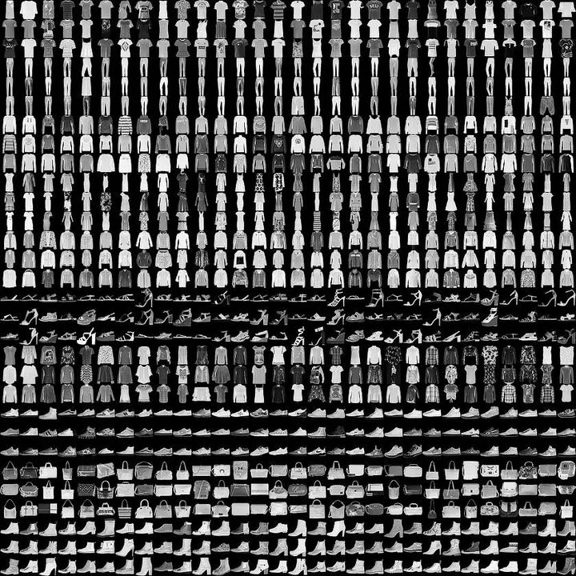
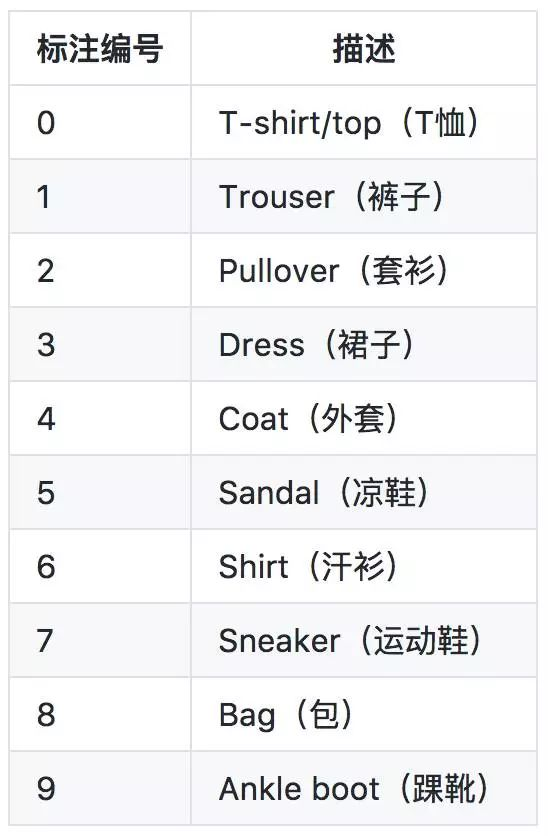
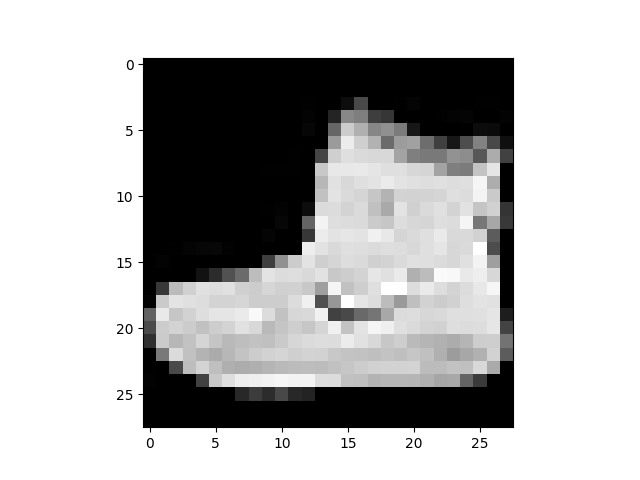

# PyTorch

Using CUDA

```python
t = torch.tensor([1, 2, 3])
t = t.cuda()
# same as 't = torch.tensor([1, 2, 3], device="cuda:0")'
t
```

Output

```
tensor([1, 2, 3], device='cuda:0')
```

## Tensor

| Computer Science | Mathematics |
| :--------------: | :---------: |
|      scalar      |   number    |
|      array       |   vector    |
|     2D-array     |   matrix    |
|     nD-array     |  nD-tenor   |

A nD-tensor can have more than n components, 

like, 

```python
t = [
    [1, 2, 3],
    [4, 5, 6],
    [7, 8, 9]
]
```

t is 2D but has 9 components

### Rank/Dimension/Axis

简单来说，秩rank就是张量下标的个数

t is a rank 2 tensor

秩、维度和轴是相同的，表示数组层数

For t

```python
# axis[0]
t[0]
t[1]
t[2]

# axis[1]
t[0][0]
t[1][0]
t[2][0]

t[0][1]
t[1][1]
t[2][1]

t[0][2]
t[1][2]
t[2][2]
```

In PyTorch, `t.shape` and `t.size()` can show them.

```
torch.Size([3, 3])
```

and rank is the length of shape/size

```python
len(t.shape)

2
```

### Shape

A tensor's shape is important

## CNN中的张量

CNN中的张量形状的长度通常为4，表示张量的秩为4

```
len([?, ?, ?, ?]) = 4
```

在图像中，长度和宽度表示后两个维度

第二个维度表示颜色，在RBG图像中有三个通道，灰度图有一个

第一个维度表示批量大小，也就是样本图像的数量

即

```
[B, C, H, W]
```

如果表示3张尺寸为28*28的灰度图，则为

```
[3, 1, 28, 28]
```

实际表示

```python
dd = torch.tensor([
    [[[1, 1, 1],
      [1, 1, 1],
      [1, 1, 1]]],

    [[[1, 1, 1],
      [1, 1, 1],
      [1, 1, 1]]],

    [[[1, 1, 1],
      [1, 1, 1],
      [1, 1, 1]]]
])
```

### 卷积中的张量

卷积改变了宽度和高度维度以及颜色通道的数量，通道的数量根据在层中的使用的数量而变化

假设有3个卷积滤波器，从卷积层得到桑通道输出，即卷积层输出，叫做输出通道，于颜色通道（输入）相反

对于1个初始单通道的图像，经过3个卷积滤波器卷积后能3个单通道，根据滤波器的大小，高度和宽度也会改变

```
[1, 1, 28, 28] -> [1, 3, 28, 28]
```

将颜色通道和卷积滤波器结合，进行一次卷积运算，得到输出通道结果，叫做特征映射，输出代表了图像的特定特征

## Tensor in PyTorch

`.dtype` 张量的类型

`.device` 张量使用的设备，默认为cpu

`.layout` 张量的布局 默认为strided

不同类型、不同设备间的张量无法进行运算操作

`torch.Tensor()` 使用整型元素创建的张量默认类型为`torch.float32`，是一种类的构造

`torch.tensor()` 使用整型元素创建的张量默认类型为`torch.int64`，是工厂函数所返回的类的对象

`torch.as_tensor()` 和 `torch.from_numpy()` 都是利用numpy数组创建张量，默认类型和`torch.tensor()`相同，不同的是`torch.Tensor()` 和 `torch.tensor()`会直接创建对象，**元素不会随numpy数组的元素改变而改变**，而`torch.as_tensor()` 和 `torch.from_numpy()` 则会

`torch.Tensor()` 和 `torch.tensor()` 是复制内存数据创建张量，`torch.as_tensor()` 和 `torch.from_numpy()` 创建的张量于原numpy数组共享内存

```python
import torch
import numpy as np

data = np.array([1, 2, 3])
t1 = torch.Tensor(data)
t2 = torch.tensor(data)
t3 = torch.as_tensor(data)
t4 = torch.from_numpy(data)

for i in range(3):
    data[i] = 0

print(t1)
print(t2)
print(t3)
print(t4)
```

输出

```
tensor([1., 2., 3.])
tensor([1, 2, 3], dtype=torch.int32)
tensor([0, 0, 0], dtype=torch.int32)
tensor([0, 0, 0], dtype=torch.int32)
```

## 张量操作

### Reshape

```python
t = torch.tensor([
    [1, 1, 1, 1],
    [2, 2, 2, 2],
    [3, 3, 3, 3]
], dtype=torch.float32)
```

使用`.reshape(m, n)`可以在不改变秩的情况下改变张量的形状

如果 `m*n` = 张量的元素数量则不会出现不必要的问题

使用`.reshape(i, j, k)`会改变原本的维度

`.squeeze()` 压缩张量 移除所有长度为1的轴

`.unsqueeze(n)` 解缩张量 在指定维度增加长度为1的轴

flatten

```python
def flatten(t):
    t = t.reshape(1, -1)	# [[1, 2, 3, ...]]
    t = t.squeeze()			# [1, 2, 3, ...]
    return t

t.reshape(1, -1)		# [[1., 1., 1., 1., 2., 2., 2., 2., 3., 3., 3., 3.]]
flatten(t)				# [1., 1., 1., 1., 2., 2., 2., 2., 3., 3., 3., 3.]
```

将张量拉成一个一维的数组

- 将一个`m*n`的张量转为一个`1*(m*n)`的张量
- 去掉最外层的轴

实际上通过`.reshape()`也可以实现`flatten(t)`

```python
t.reshape(-1)
t.reshape(12) #same as t.reshape(t.numel)
t.reshape(1, -1)[0]
t.view(t.numel)
t.flatten()
```

### Flatten

传递给全连接层的卷积层输出必须在进入全连接层之前进行flatten

flatten是作为CNN输入的需要

```python
t1 = torch.tensor([
    [1, 1, 1, 1],
    [1, 1, 1, 1],
    [1, 1, 1, 1],
    [1, 1, 1, 1]
])
t2 = torch.tensor([
    [2, 2, 2, 2],
    [2, 2, 2, 2],
    [2, 2, 2, 2],
    [2, 2, 2, 2]
])
t3 = torch.tensor([
    [3, 3, 3, 3],
    [3, 3, 3, 3],
    [3, 3, 3, 3],
    [3, 3, 3, 3]
])

t = torch.stack((t1, t2, t3))
```

假设t1，t2，t3为3个`4*4`的单通道图像，t为一个秩为3，形状为3个`4*4`的单通道图像集，但是隐式单通道，要转为显式单通道，则

```python
t = t.reshape(3, 1, 4, 4)
```

于是

```python
t[0]			# 第一个图像
tensor([[[1, 1, 1, 1],
         [1, 1, 1, 1],
         [1, 1, 1, 1],
         [1, 1, 1, 1]]])

t[0][0]			# 第一个图像的第一个通道
tensor([[1, 1, 1, 1],
        [1, 1, 1, 1],
        [1, 1, 1, 1],
        [1, 1, 1, 1]])

t[0][0][0]		# 第一个图像的第一个通道的第一行
tensor([1, 1, 1, 1])

t[0][0][0][0]	# 第一个通道的第一个图像的第一行的第一个元素
tensor(1)
```

如果直接进行`.flatten()`则会将3张图片压扁到一个轴上

而真正需要的是将3张图片分别压缩到3个轴上

```python
# 每一张图片进行压扁
tt1 = t[0].reshape(-1)
tt2 = t[1].reshape(-1)
tt3 = t[2].reshape(-1)
tt = torch.stack((tt1, tt2, tt3))

# 使用.flatten()
t = t.flatten(start_dim=1)
```

`start_dim=1`是指定`.flatten()`的维度

## 张量运算

### 算数运算

理论上讲，张量的形状要相同

```python
t1 = torch.tensor([
    [1, 2],
    [3, 4]
], dtype=torch.float32)
t2 = torch.tensor([
    [9, 8],
    [7, 6]
], dtype=torch.int64)

print(t1 + t2)
```

纯数

```python
(t1 + 2)	# t1.add(2)
(t1 - 2)	# t1.sub(2)
(t1 * 2)	# t1.mul(2)
(t1 / 2)	# t1.div(2)
```

#### 张量广播 broadcast

在numpy中

```python
import numpy as np
np.broadcast_to(2, t1.shape)

t1 + 2
# 等价于
t1 + torch.tensor(np.broadcast_to(2, t1.shape), dtype=torch.float32)
```

对于不同形状的张量也会进行张量广播

```python
t1 = torch.tensor([
    [1, 1],
    [1, 1]
], dtype=torch.float32)
t2 = torch.tensor([2, 4], dtype=torch.float32)

t1 + t2		# 张量广播
```

### 比较运算

```python
t = torch.tensor([
    [0, 6, 7],
    [8, 0, 8],
    [0, 8, 0],
], dtype=torch.float32)

t.eq(0)		# or t == 0 等于
t.ge(0)		# or t >= 0 大于等于
t.gt(0)		# or t > 0  大于
t.le(0)		# or t <= 0 小于等于
t.lt(0)		# or t < 0 小于
```

输出格式为张量

```
tensor([[ True, False, False],
        [False,  True, False],
        [ True, False,  True]])
tensor([[True, True, True],
        [True, True, True],
        [True, True, True]])
tensor([[False,  True,  True],
        [ True, False,  True],
        [False,  True, False]])
tensor([[ True, False, False],
        [False,  True, False],
        [ True, False,  True]])
tensor([[False, False, False],
        [False, False, False],
        [False, False, False]])
```

### 其他

```python
t.abs()		# 取绝对值
t.sqrt()	# 元素开方
t.neg()		# 取负数
```

张量是深度学习中的重要数据结构

## 张量操作

### 缩减 Reduction

- 重塑操作是确定张量某一轴的长度
- 运算操作是两个张量之间的操作
- 缩减操作是单个张量的操作

#### 求和

```python
t = torch.tensor([
    [0, 1, 0],
    [2, 0, 2],
    [0, 3, 0],
], dtype=torch.float32)

t.sum()						# tensor(8.)
t.sum().numel() < t.numel()	#True
```

之所以称之为缩减操作，经过操作之后返回的张量的元素个数会小于原张量的元素的个数

不同维度求和

```python
t = torch.tensor([
    [1, 1, 1, 1],
    [2, 2, 2, 2],
    [3, 3, 3, 3],
], dtype=torch.float32)

t.sum(dim=0)	# tensor([6., 6., 6., 6.])
# same as t[0] + t[1] + t[2]
t.sum(dim=1)	# tensor([ 4.,  8., 12.])
# same as
# t[0].sum() = tensor(4.), t[1].sum() = tensor(8.), t[2].sum() = tensor(12.)
```

`argmax`/`argmin`

返回张量最大/最小值的索引，使用`dim`参数指定维度


而`.max()`/`.min()`返回的是最大/最小值

`.mean()` 张量中的元素求平均值

如果返回的`torch.tensor()`中只有一个数可以用`.item()`返回

```python
t.sum().item()			# 31.
```

如果是数组，则使用`.tolist()`转化为列表

```python
t.sum(dim=0).tolist()	# [6.0, 13.0, 6.0, 6.0]
```

如果转化为numpy数组，则使用`.numpy()`

```python
t.sum(dim=0).numpy()	# [ 6. 13.  6.  6.]
```

## 数据

### MNIST数据集

用于训练机器学习的图像处理系统的数据集，由来自 250 个不同人手写的数字构成, 其中 50% 是高中学生, 50% 来自人口普查局的工作人员. 测试集也是同样比例的手写数字数据.



另外一种MNIST数据集代替原有的手写数字的为Fashion-MNIST



每一种样本类型都有特定的标号



##  建立项目的过程

- 准备数据
- 建立模型
- 训练模型
- 分析模型结果

### E(xtract)T(ransform)L(oad)

- 从数据源提取数据 - get the image data from the source
- 将数据转换为理想格式 - put our data into tensor form
- 将数据加载到一个合适的结构中进行查询和分析 - put our data into an object to make it easily accessible 

`torch.utils.data.Dataset` 数据集的抽象类

`torch.utils.data.Dataloader` 数据封装器 封装数据集并提供对底层数据的访问

```python
class OHLC(Dataset):
    def __init__(self, csv_file):
        self.data = pd.read_csv(csv_file)

    def __getitem__(self, index):
        r = self.data.iloc[index]
        label = torch.tensor(r.is_up_day, dtype=torch.long)
        sample = self.normalize(torch.tensor([r.open, r.high, r.low, r.close]))
        return sample, label

    def __len__(self):
        return len(self.data)
```

下载Fashion-MNIST数据集

```python
import torchvision
import torchvision.transforms as transforms

train_set = torchvision.datasets.FashionMNIST(
    root='./data/FashionMNIST',		# 数据所在的硬盘上的位置
    train=True,						# 训练参数 数据使用于训练集的
    download=True,
    transform=transforms.Compose([	#转换参数 将图像转化为张量
        transforms.ToTensor()
    ])
)

train_loader = torch.utils.data.Dataloader(train_set)
# or torch.utils.data.dataloader.Dataloader(train_set)
```

从ELT的角度来看，以上操作完成了转换和加载

## Datasets & DataLoader

在PyTorch中有两个重要的类：Datasets （`torch.utils.data.Dataset`） & DataLoader （`torch.utils.data.Dataloader`）

对于上一节下载Fashion-MNIST数据集的代码

```python
train_set = torchvision.datasets.FashionMNIST(
    root='./data/FashionMNIST',
    train=True,
    download=True,
    transform=transforms.Compose([
        transforms.ToTensor()
    ])
)
train_loader = torch.utils.data.Dataloader(
    train_set, batch_size=10
)
```

- `root='./data/FashionMNIST'` 指向指定的数据集加载路径
- `train=True` 表示加载的为训练集
- `download=True` 如果数据集不存在，则下载数据集指定的路径`root`
- `transform=transforms.Compose([transforms.ToTensor()])` 执行类型转换 把数据转化为一个张量
- 这里`train_loader`设置了有个批量处理数量参数`batch_size`

```python
len(train_set)
train_set.train_labels
# train_labels has been renamed targets
train_set.train_labels.bincount()
```

输出

```
60000
tensor([9, 0, 0,  ..., 3, 0, 5])
tensor([6000, 6000, 6000, 6000, 6000, 6000, 6000, 6000, 6000, 6000])
```

- `len(train_set)` 的结果为60000，即读取Fashion-MNIST中的十组的数据量
- `train_set.train_labels/targets` 即每一个数据对应的Fashion-MNIST的标号
- `train_set.train_labels/targets.bincount()` 每一类的数据数量，每组的数量相同，称为**平衡数据集**；反之为**不平衡数据集**

利用Python自带的`next(iter())`来提取`train_set`中的第一个数据

```python
sample = next(iter(train_set))
print(len(sample))		# 2
print(type(sample))		# turple
```

`sample`是一个**元组**，其中包括两个元素，一个是图片组成的张量，一个是对应Fashion-MNIST的标号

把两个元素分别传给量变量，这样得到一个图片，类型为tensor，一个标号，类型为int，利用matplotlib可以显示图片

```python
image, label = sample
plt.imshow(image.squeeze(), cmap='gray')
print('label', label)
plt.show()
```

得到结果

```
label 9
```



提取`train_loader`中的第一个数据时，由于`train_loader`是对`train_set`分批处理的，因此读取`train_loader`的一个数据时，其实时一个含有十个数据的数据集

```python
batch = next(iter(train_loader))
print(len(batch))
print(type(batch))
images, labels = batch
```

`batch`是一个两个元素的**列表**，分别为10个图像组成的张量，和对应的标号组成的张量

这时，`image.shape`为

```
torch.Size([10, 1, 28, 28])
```

即10张尺寸为28*28的单通道图像

如果把这10张图像一次性输出，需要一个函数转换一下数据结构

```python
grid = torchvision.utils.make_grid(images, nrow=10)

plt.figure(figsize=(15, 15))
plt.imshow(np.transpose(grid, (1, 2, 0)))
print('labels', labels)
plt.show()
```

```
labels tensor([9, 0, 0, 3, 0, 2, 7, 2, 5, 5])
```


## Build CNN

构建神经网络的主要部件是层，每一层都有两个主要组成部分，一个是**变换(transformation)**，一个是**权重的集合(collection of weight)**

在神经网络中，有一个称为**模块(module)**，是所有神经网络模块的基类：PyTorch中的`nn.Module`类

层是函数，神经网络是由一组函数组成，其本身也是函数

当一个张量传递给网络作为输入，张量通过每个层变换向前**流动(flow)**，直到张量传入输入层，这个过程称为前向传输

每一层都有自己的变换，张量经过每一层的变换，所有单独的层的向前通道的组成定义了网络本身的向前转换，**每次构建层时都需要提供一个向前传输**，向前传输就是变换；每一个PyTorch`nn.Module`都有一个**前向方法(forward() method)**来表示向前传输

用PyTorch构建神经网络

1. 创建一个扩展`nn.Module`模块基类
2. 在类构造函数中将网络的层定义为类属性
3. 使用网络层属性以及`nn.functional`API的函数，定义网络的向前传输

```python
class Network:
    def __int__(self):
        self.layer = None

    def forward(self, t):
        t = self.layer(t)
        return t
```

一个简单的神经网络类：构造函数中有一个虚拟层，并为前向函数提供了一个虚拟实现

向前函数的实现采用张量t，并使用虚拟层对其进行转换，转换后新的张量被返回

引入`nn.Module`

```python
class Network(nn.Module):
    def __int__(self):
        super(Network, self).__init()	# 超级构造类
        self.layer = None

    def forward(self, t):
        t = self.layer(t)
        return t
```

以上代码网络类只有一个虚拟层作为属性

## CNN Layer
```python
class Network(nn.Module):
    def __int__(self):
        super(Network, self).__init()
        # 卷积层
        self.conv1 = nn.Conv2d(in_channels=1, out_channels=6, kernel_size=5)
        self.conv2 = nn.Conv2d(in_channels=6, out_channels=12, kernel_size=5)

        # 线性层
        # 全连接层fully-connected layer(fc)
        self.fc1 = nn.Linear(in_features=12*4*4, out_features=120)
        self.fc1 = nn.Linear(in_features=120, out_features=60)
        self.out = nn.Linear(in_features=60, out_features=10)

    def forward(self, t):
		# implement the forward pass
        return t
```

在每一层中，都有封装了两个项目：**前向函数**和**权重张量**

每层中包含了随着训练不断更新的权重值