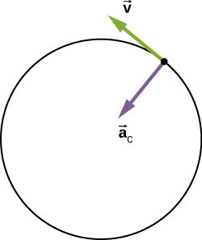

## 力与运动学 Force and Kinematic 01 - 1D

### 运动学图像

描述运动的等式和图像

**EXP. 1 静止物体 Motionless Body**

- 等式  $x = 40cm$ 

- 图像 横轴 时间$t/s$ 纵轴 位置$x/cm$

  (3, 40) (5, 40) ...

**EXP. 2 匀速运动物体 Uniformly Moving Body**

- 图像

  (0, $x_i$) (1, $x_i+k$) (2, $x_i+2k$) (3, $x_i+3k$) ... (i: initial)

  

  - 斜率即为速度

- 单位时间移动相同的矢量

### 位移 Displacement

**$x$  位置**（时间表达式）

**$\Delta \vec x$ 位移** 两个不同时间位置的变化
$$
\vec{\Delta x} =x_f-x_i
$$
$\Delta \vec x$可以是负数

> negative: *adj*. 负数的

${\Delta \vec x}$为正数向正方向，负数向负方向

$\Delta \vec x = 3\hat i$ 

- **$\hat i$** 单位向量 unit vector

### 速度 Velocity

#### 平均速度 Average Velocity - 在间隔$\Delta t$

$$
\vec v_{avg}=\frac{\Delta \vec x}{\Delta t} = \frac{\vec x_f-\vec x_i}{t_f-t_i}
$$

($t_i$, $x_i$)  $->$ ($t_f$, $x_f$)

- 斜率slope即为速度

- 对应前后不同速度的运动，两短时间的平均速度为两时刻位移点连线的斜率

#### 瞬时速度 Instantaneous Velocity

在**很短**一段时间（几乎为0）的位移

$\vec v_{avg}=\frac{\Delta \vec x}{\Delta t}$ 当$\Delta t$很小时，称为瞬间（$\Delta t->0$）
$$
\vec v=\frac{d\vec x}{dt}
$$
瞬时速度即$x$对$t$的导数Derivative，即$x-t$图像斜率

### 距离与速率 Distance & Speed

#### 距离

物体经过的路径的长度

#### 速率

平均速率：一段时间$\Delta t$物体经过的路径的长度
$$
v_{avg}=\frac{d}{\Delta t}
$$

![Graph A shows position in meters plotted versus time in seconds. It starts at the origin, reaches maximum at 0.5 seconds, and then start to decrease crossing x axis at 1 second. Graph B shows velocity in meters per second plotted as a function of time at seconds. Velocity linearly decreases from the left to the right. Graph C shows absolute velocity in meters per second plotted as a function of time at seconds. Graph has a V-leeter shape. Velocity decreases till 0.5 seconds; then it starts to increase.](01_Force_and_Kinematic.assets/7d0221fc43cfc8187d5033c6553b3f3f47ada4fd.jpeg)

*瞬时速率是速度矢量的模
$$
v=|\vec v|\newline
v_{avg}\ge|\vec v_{avg}|
$$

> 1 yard = 3ft

### 加速度 Acceleration

物体运动速度的变化率（The rate of change of velocity）

**平均加速度**
$$
\vec a_{avg} = \frac{\Delta \vec v}{\Delta t} =  \frac{\vec v_f-\vec v_i}{t_f-t_i}
$$
**瞬时加速度**
$$
\vec a=\frac{d\vec v}{dt}
$$
瞬时加速度即$v$对$t$的导数，即$v-t$图像斜率

**伽利略**
$$
x=\frac{1}{2}at^2
$$

| $t$  |        $x$         |
| :--: | :----------------: |
|  1   | $\frac{1}{2}a(1)$  |
|  2   | $\frac{1}{2}a(4)$  |
|  3   | $\frac{1}{2}a(9)$  |
|  4   | $\frac{1}{2}a(16)$ |
|  5   | $\frac{1}{2}a(25)$ |

### 恒定加速度运动

**速度**
$$
\vec v_f=\vec v_i+\vec at
$$
**位置**
$$
\vec a=\frac{d \vec v}{dt}->d\vec v=\vec adt\\
\int^{\vec v_f}_{\vec v_i}d\vec v=\int^{t}_{0}\vec adt\\
\vec v_f-\vec v_i=\vec at
$$

$$
\vec v=\frac{d \vec x}{dt}->d\vec x=\vec vdt\\
\int^{\vec x_f}_{\vec x_i}d\vec x=\int^{t}_{0}\bold{\vec v}dt\\
\vec x_f-\vec x_i=\int^{t}_{0}\bold{(\vec v_i+\vec at)}dt=\vec v_it+\frac{1}{2}\vec at^2
$$

$$
\Delta x=\vec v_it+\frac{1}{2}\vec at^2\\
2a(\Delta x)=2v_i(v_f-v_i)+(v_f-v_i)^2\\
\vec v_f^2=\vec v_i^2-2a(\Delta x)
$$

> constant: *adj.* 恒定的

## 力与运动学 Force and Kinematic 02 - 2D

二维平面的运动学可以将$x$和$y$分开考虑

Two separate motions
$$
\vec x_f=\vec x_i +\vec v_xt\\
\vec y_f=\vec y_i +\vec v_yt
$$

### 位置向量$\vec r$

从原点的位移

$$
\vec r=x\hat i+y\hat j
$$

$$
\vec v_{avg}=\frac{\Delta \vec r}{\Delta t}\\
\vec v=\frac{d\vec r}{dt}
$$

> trajectory: *adj.* 轨迹

将$x$和$y$分离
$$
\Delta\vec r=(x_i+v_xt)\hat i+(y_i+v_yt)\hat j
$$

#### Shoot

$$
\Delta\vec r=(x_i+v_{x_i}t+\frac{1}{2}a_xt^2)\hat i+(y_i+v_{y_i}t+\frac{1}{2}a_yt^2)\hat j\\
$$

$$
\vec a\ne0(Gravity)\\
\Delta\vec r=(v_{x_i}t)\hat i+(y_i+\frac{1}{2}a_yt^2)\hat j\\
\vec v=v_x\hat i+at\hat j\\
\vec a=9.8\hat j
$$

#### Shoot & Drop

$$
\vec r_d=0\hat i+(y_i-\frac{1}{2}gt^2)\hat j\\
\vec r_s=(v_it)\hat i+(y_i-\frac{1}{2}gt^2)\hat j\\
不用考虑水平方向\\
y_i-\frac{1}{2}gt^2=0\ 落地\\
t=\sqrt{\frac{2y_i}{g}}
$$
平抛运动与自由落体运动竖直方向等价

### 轨迹 Trajectory

$$
\vec r = \vec v_it+\frac{1}{2}\vec gt^2
$$
设初始速度与水平方向的夹角为$\theta$
$$
\vec r=(v_i\cos\theta t)\hat i+(v_i\sin\theta t-\frac{1}{2}gt^2)\hat j
$$

#### 时间，距离，高度

**时间 （$y=0$）**
$$
v_i\sin\theta t_H-\frac{1}{2}gt_H^2=0\\
t_H(v_i\sin\theta-\frac{1}{2}gt_H)=0\\
t_H=0(Beginning)\qquad t_H=\frac{2v_i\sin\theta}{g}
$$
**距离**
$$
R=(v_i\cos\theta)(\frac{2v_i\sin\theta}{g})=\frac{2v_i^2\sin\theta\cos\theta}{g}
$$
**高度**
$$
H=v_i\sin\theta(\frac{1}{2}t_H)-\frac{1}{2}g(\frac{1}{2}t_H)^2=\frac{v_i^2\sin^2\theta}{2g}
$$

### 匀速圆周运动 Uniform Circular Motion

- 匀速：指**速率speed**不变

- 加速度只改变速度方向

向心加速度 Centripetal acceleration
$$
|\vec a_c|=\frac{v^2}{r}
$$
*初步证明$|\vec a_c|=\frac{v^2}{r}$

$$
\frac{\Delta v}{v}=\frac{\Delta r}{r}\\
\Delta v=\frac{v}{r}\Delta r\\
a=\lim_{\Delta t\to0}(\frac{\Delta v}{\Delta t})=\frac{v}{r}\lim_{\Delta t\to0}(\frac{\Delta r}{\Delta t})=\frac{v^2}{r}
$$

#### 周期圆周运动

##### 周期 Period

$$
T =\frac{2\pi r}{v}
$$

##### 角速度 Angular speed

$$
\omega=\frac{2\pi}{T}=\frac{v}{r}\\
a_c=\omega^2r=\frac{4\pi^2r}{T^2}=(\frac{2\pi}{T})^2r
$$

#### 非匀速圆周运动 Nonuniform Circular Motion

**切向加速度 tangential acceleration**
$$
a_T=\frac{d|\vec v|}{dt}
$$

$$
\vec a=\vec a_T+\vec a_c
$$

### 相对运动 Relative Motion

**1D**

**2D**

**3D**

