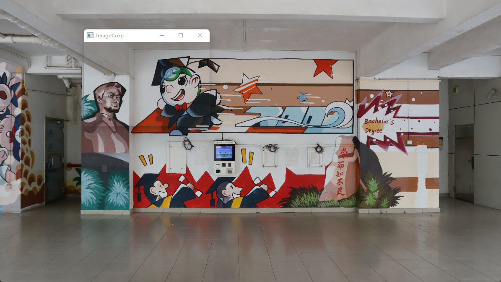
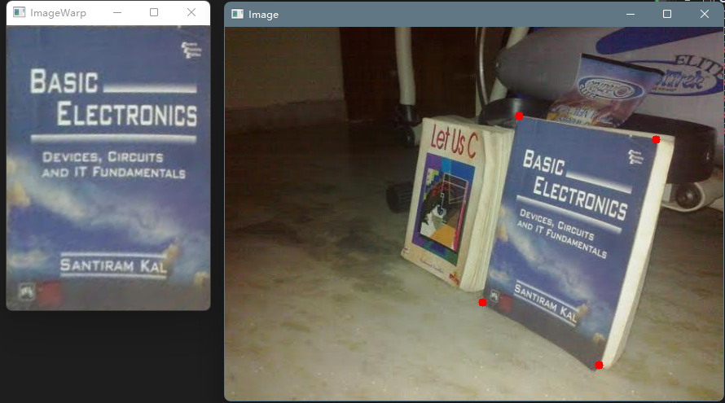
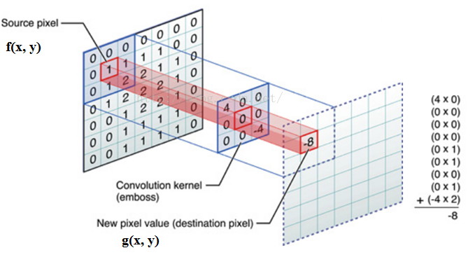

## 数据读取与显示

### 一、图片读取与显示

#### 图片读取

```c++
Mat cv::imread(const String &filename,		//文件地址
               int flag=IMREAD_COLOR)		//读取文件的形式，默认彩色
```

|     形式参数     | 简记 |       作用       |
| :--------------: | :--: | :--------------: |
| IMREAD_UNCHANGED |  -1  |  保留Alpha通道   |
| IMREAD_GRAYSCALE |  0   | 转成单通道灰度图 |
|   IMREAD_COLOR   |  1   |    默认彩色图    |

#### 图片显示

```c++
void cv::imshow(const String &winname		//显示窗口名称
                InputArray mat)				//输出的图像矩阵
```

#### 完整代码

```c++
#include <opencv2\opencv.hpp>
#include <iostream>

using namespace std;
using namespace cv;

int main()
{
	Mat img;
	img = imread("IMG.jpg");
	imshow("test", img);
	waitKey(0);
	return 0;
}
```

### 二、视频读取

#### 视频读取以及摄像头调用

```c++
cv::VideoCapture(const String &filename			//文件地址 若为整数则为摄像头调用 系统默认摄像头为0
                 int apiPreference = CAP_ANY)	//读取数据时的属性
```

还需要将图像由VideoCapture类变量里导入到Mat类变量，用于后期数据处理，可以通过“>>"运算符将图像按照视频的顺序由VideoCapture类变量赋值给Mat类变量。

当VideoCapture类变量全部赋值给Mat类变量后，再次赋值会Mat类变量变为空矩阵。可以通过empty()判断VideoCapture类变量中是否所有图像都已经读取完毕

#### 完整代码

```c++
#include <iostream>
#include <opencv.hpp>

using namespace std;
using namespace cv;

int main()
{
	VideoCapture video("Video.mp4");
	//VideoCapture video(0);//获取默认摄像头
	if (video.isOpened()) {
		cout << "视频中图像的宽度=" << video.get(CAP_PROP_FRAME_WIDTH) << endl;
		cout << "视频中图像的高度=" << video.get(CAP_PROP_FRAME_HEIGHT) << endl;
		cout << "视频帧率=" << video.get(CAP_PROP_FPS) << endl;
		cout << "视频总帧数=" << video.get(CAP_PROP_FRAME_COUNT);
	}    
	while (1) {
		Mat frame;
		video >> frame;
		if (frame.empty()) {
			break;
		}
		imshow("video", frame);
		waitKey(1000 / video.get(CAP_PROP_FPS));
        /*waitKey()内的单位为ms(1s = 1000ms)
        video.get(CAP_PROP_FPS)是获取视频的帧率
        1000/video.get(CAP_PROP_FPS) 就是每张图像显示的时间 也就是1/帧率
        这样一来就可以按照原视频帧率显示图像*/
	}
	waitKey();
	return 0;
```

## 图像处理

### 一、图像二值化

```c++
double cv::threshold(InputArray src,		//待二值化图像 只能是CV_8U和CV_32F两种类型
                     OutputArray dst,		//二值化后的图像，与输入的图像的尺寸、数据类型和通道数相同
                     double tresh,			//阈值
                     double maxval,			//二值化的最大值 只在THRESH_BINARY和THRESH_BINARY_INV中使用
                     int type)				//二值化的方法和标志
```

**阈值**：二值化的实现，就是给定一个阈值，计算所有像素灰度值与这个阈值的关系，最终得到结果。

函数的一部分参数和返回指针对特定的函数才有用，即使有些算法用不到，也要明确给出，不可默认

|     标志参数      | 简记 |             作用             |
| :---------------: | :--: | :--------------------------: |
|   THRESH_BINARY   |  0   | 大于阈值的为最大值，其余为零 |
| THRESH_BINARY_INV |  1   | 大于阈值的为0，其余为最大值  |
|   THRESH_TRUNC    |  2   |  大于阈值的为阈值，其余不变  |
|   THRESH_TOZERO   |  3   |   大于阈值的不变，其余为0    |
| THRESH_TOZERO_INV |  4   |    大于阈值为0，其余不变     |
|    THRESH_OTSU    |  8   |    大津法自动寻求全域阈值    |
|  THRESH_TRIANGLE  |  16  |   三角形发自动寻求全局阈值   |

**效果如下图**


`threshold()`函数全局只有一个阈值，也就可能导致区域分化明显

`adaptiveThreshold(`)函数具有两种局部自适应阈值的二值化方法

```c++
void cv::adaptiveThrehold(InutArray src,		//待二值化的图像
                          OutputArray dst,		//二值化后的图像
                          double MaxValue,		//二值化的最大值
                          int adaptiveMethod,	/*自适应确定阈值的方法
                     							分为均值法ADAPTIVE_THRESH_MEAN_C
                     							和高斯法ADAPTIVE_THRESH_GAUSSIAN_C*/
                          int thresholdType,	//二值化的方法，只能是THRESH_BINARY和THRESH_BINARY_INV
                          int blockSize,			//自适应确定阈值的像素邻域大小，一般为大于1的奇数
                          double C)				//从平均值或加权平均值加上或减去的常数
```

#### 完整代码

```c++
#include <iostream>
#include <opencv.hpp>
#include <vector>

using namespace std;
using namespace cv;

int main()
{
	Mat img = imread("lena.jpg");
	Mat gray;
	cvtColor(img, gray, COLOR_BGR2GRAY);
	Mat img_B, img_B_V, gray_B, gray_B_V, gray_T, gray_T_V, gray_TRUNC;

	//彩色图像二值化
	threshold(img, img_B, 125, 255, THRESH_BINARY);
	threshold(img, img_B_V, 125, 255, THRESH_BINARY_INV);
	imshow("img_B", img_B);
	imshow("img_B_V", img_B_V);

	//灰度图BINARY二值化
	threshold(gray, gray_B, 125, 255, THRESH_BINARY);
	threshold(gray, gray_B_V, 125, 255, THRESH_BINARY_INV);
	imshow("gray_B", gray_B);
	imshow("gray_B_V", gray_B_V);

	//灰度图像TOZER变换
	threshold(gray, gray_T, 125, 255, THRESH_TOZERO);
	threshold(gray, gray_T_V, 125, 255, THRESH_TOZERO_INV);
	imshow("gray_T", gray_T);
	imshow("gray_T_V", gray_T_V);

	//灰度图像TRUNC变换
	threshold(gray, gray_TRUNC, 125, 255, THRESH_TRUNC);
	imshow("gray_TRUNC", gray_TRUNC);

	//灰度图像大津法和三角形法二值化
	Mat img_Thr = imread("imageTextN.png", IMREAD_GRAYSCALE);
	Mat img_Thr_0, img_Thr_T;
	threshold(img_Thr, img_Thr_0, 50, 255, THRESH_BINARY | THRESH_OTSU);
	threshold(img_Thr, img_Thr_T, 55, 255, THRESH_BINARY | THRESH_TRIANGLE);
	imshow("img_Thr", img_Thr);
	imshow("img_Thr_0", img_Thr_0);
	imshow("img_Thr_T", img_Thr_T);

	//灰度自适应二值化
	Mat adaptive_mean, adaptive_gauss;
	adaptiveThreshold(img_Thr, adaptive_mean, 255, 
                      ADAPTIVE_THRESH_MEAN_C, THRESH_BINARY, 55, 0);
	adaptiveThreshold(img_Thr, adaptive_gauss, 255, 
                      ADAPTIVE_THRESH_GAUSSIAN_C, THRESH_BINARY, 55, 0);
	imshow("adaptive_mean", adaptive_mean);
	imshow("adaptive_gauss", adaptive_gauss);

	waitKey(0);
	return 0;
}
```


### 二、裁剪

```cpp
cv::Rect roi(int x, int y, int width, int height);
imgCrop = img(roi);
```

`x`, `y`为起始坐标；`width`, `height`为裁剪大小

#### 完整代码

```cpp
#include <opencv.hpp>
#include <iostream>

using namespace cv;
using namespace std;

int main()
{
	string path = "2.jpg";
	Mat img = imread(path);
	Mat imgCrop;
    
	Rect roi(500, 100, 500, 400);
	imgCrop = img(roi);

	imshow("Image", img);
	imshow("ImageCrop", imgCrop);
	waitKey(0);
	return 0;
}
```



### 三、透视变换

#### 完整代码

```cpp
#include <opencv.hpp>
#include <iostream>

using namespace cv;
using namespace std;

int main()
{
	string path = "right.jpg";
	Mat img = imread(path);
    
    float w = 250, h = 350;
	Mat matrix, imgWarp;


	Point2f src[4] = { {361,109},{529,138},{316,338},{459,415} };
	Point2f dst[4] = { {0.0f,0.0f},{w,0.0f},{0.0f,h},{w,h} };

	matrix = getPerspectiveTransform(src, dst);
	warpPerspective(img, imgWarp, matrix, Size(w, h));
    
	imshow("Image", img);
	imshow("ImageWarp", imgWarp);
	
	waitKey(0);
	return 0;
}
```



## 图像滤波

### 一、图像卷积

卷积需要一个卷积模板（或者叫卷积核或者内核）和原始图像。整个过程可以看作一个模板在一大的图像上运动，对每个卷积模板覆盖的区域进行点乘，得到的值作为中心像素点的输出值。**卷积首先要将卷积模板旋转180°**（如果是中心对称可以忽略），从左到右，从上到下依次进行卷积计算，得到最终的图像。



卷积模板中心无法放到图像边缘的像素处，因为当卷积模板的中心与图像的边缘对应时，模板部分数据会出现没有图像像素对应的情况，因此边缘区域没有办法进行卷积运算。为了解决这个问题，我们可以把主动把图像的边缘外推。

```c++
void cv::fileter2D(InputArray src,					//输入图像
                   OutoutArray dst,					//输出图像
                   int ddepth,						//输出图像类型
                   IntputArray kernel,				//卷积模板 CV_32FC1类型
                   Point anchor = Point(-1,-1),		//内核的基准点 默认值(-1,-1)代表中心
                   double delta = 0,					//偏值 计算结果加上的值
                   int borderType = BORDER_DEFAULT)	//像素外推法类型 默认为BORDER_DEFAULT
```

| 输入图像的数据类型 | 输出图像的可选数据类型  |
| :----------------: | :---------------------: |
|       CV_8U        | -1/CV_16S/CV_32F/CV_64F |
|   CV_16U/CV_16S    |    -1/CV_32F/CV_64F     |
|       CV_32F       |    -1/CV_32F/CV_64F     |
|       CV_64F       |        -1/CV_64F        |

**边界外推方法标志**

|      方法标志      | 简记 |                       作用                       |
| :----------------: | :--: | :----------------------------------------------: |
|  BORDER_CONSTANT   |  0   |      用特定值填充 iiiii\|abcdefgh\|iiiiiii       |
|  BORDER_REPLICATE  |  1   |      两端复制填充 aaaaaa\|abcdefgh\|hhhhhhh      |
|   BORDER_REFLECT   |  2   |       倒序填充 fedcba\|abcdefgh\|hgfedcba        |
|    BORDER_WRAP     |  3   |       正序填充 cdefgh\|abcdefgh\|abcdefhg        |
| BORDER_REFLECT_101 |  4   | 不包含边界值的倒序填充 gfedcb\|abcdefgh\|gfedcba |
| BORDER_TRANSPARENT |  5   |        随机填充 uvwxyz\|abcdefgh\|ijklmno        |
| BORDER_REFLECT101  |  4   |             与BORDER_REFLECT_101相同             |
|   BORDER_DEFAULT   |  4   |             与BORDER_REFLECT_101相同             |
|  BORDER_ISOLATED   |  16  |            不关心感兴趣区域之外的部分            |

有时通过卷积的计算得出的结果**可能超出某一数据类型的最大值**（比如CV_8U最大值为255），因此在图像卷积操作常将卷积模板通过缩放使得所有数值的和为1，进而解决卷积越界的情况，如以下代码中将卷积模板所有数值除以12后再进行卷积操作

#### 完整代码

```c++
#include <iostream>
#include <opencv.hpp>

using namespace std;
using namespace cv;

int main()
{	
    //矩阵卷积
	//待卷积矩阵
	uchar points[25] = { 1,2,3,4,5,
						6,7,8,9,10,
						11,12,13,14,15,
						16,17,18,19,20,
						21,22,23,24,25 };
	Mat img(5, 5, CV_8UC1, points);

	//卷积模板
	Mat kernel = (Mat_<float>(3, 3) << 1, 2, 1,
										2, 0, 2,
										1, 2, 1);
	Mat kernel_norm = kernel / 12;

	Mat result, result_norm;
	filter2D(img, result, CV_32F, kernel, Point(-1, -1), 2, BORDER_CONSTANT);
	filter2D(img, result_norm, CV_32F, kernel_norm, Point(-1, -1), 2, BORDER_CONSTANT);
	cout << "result" << endl << result << endl;
	cout << "result_norm" << endl << result_norm << endl;

	//图像卷积
	Mat lena = imread("lena.jpg");
	Mat lena_filter;
	filter2D(lena, lena_filter, -1, kernel_norm, Point(-1, -1), 2, BORDER_CONSTANT);
	imshow("lena", lena);
	imshow("lena_filter", lena_filter);
	
	waitKey(0);
	return 0;
}
```


### 二、滤波（只做了解）

#### 1.1 均值滤波

典型的线性滤波算法，它是指在图像上对目标像素给一个模板，该模板包括了其周围的临近像素（以目标像素为中心的周围8个像素，构成一个滤波模板，即去掉目标像素本身），再用模板中的全体像素的平均值来代替原来像素值

```c++
void cv::blur(InputArray src,					//
              OutputArray dst,
              Size ksize,
              Point anchor = Point(-1,-1),
              int borderType = BORDER_DEFAULT)
```


## 图像形态学

### 一、腐蚀和膨胀

腐蚀和膨胀的过程和卷积类似，都需要模板来控制运算结果。在腐蚀和膨胀中，这个模板称为结构元素。定义结构元素之后，将结构元素绕着中心点进行180°旋转。将结构元素的中心点依次放到图像中每一个非0元素处，**如果此时结构元素内所有的元素所覆盖的图像像素值均不为0，则保留结构元素中心点对应的图像像素，否则将删除结构元素中心点对应的像素**

**生成结构元素**

```c++
Mat cv::getStructuringElement(int  shape,							//结构元素的种类
                              Size ksize,							//结构元素的尺寸
                              Point anchor = Point(-1,-1))			//中心点的位置 
```

**结构元素的种类**

|   标志参数    | 简记 |                作用                |
| :-----------: | :--: | :--------------------------------: |
|  MORPH_RECT   |  0   |     矩形结构元素 所有元素都为1     |
|  MORPH_CROSS  |  1   |  十字结构元素 中间的行和列元素为1  |
| MORPH_ELLIPSE |  2   | 椭圆结构元素 矩形的内接椭圆元素为1 |

#### 1.1 腐蚀


左侧为待腐蚀的原图像，中间为结构元素，首先将结构元素的中心与原图像中的A像素重合，此时结构元素中心点的左侧和上方元素所覆盖的图像像素值均为0，因此需要将原图像中的A像素删除；当把结构元素的中心点与B像素重合时，此时结构元素中所有的元素所覆盖的图像像素值均为1，因此保留原图像中的B像素。将结构元素中心点依次与原图像中的每个像素重合，判断每一个像素点是否保留或者删除，最终原图像腐蚀的结果如右侧图像所示

```c++
void cv::erode(InputArray  src,							//待腐蚀的图像
               OutputArray  dst,						//输出的图像
               InputArray  kernel,						/*用于腐蚀的结构元素 可以自己定义或者
               												getStructuringElement()生成*/
               Point  anchor = Point(-1,-1),			//中心点在结构元素中的位置
               int  iterations = 1,						//腐蚀次数 默认是1
               int  borderType = BORDER_CONSTANT,		//像素外推的选择标志 默认为BORDER_DEFAULT
               const Scalar &  borderValue				//使用边界不变外推法时的边界值
               = morphologyDefaultBorderValue())
```

**需要注意的是该函数的腐蚀过程只针对图像中的非0像素，因此如果图像是以0像素为背景，那么腐蚀操作后会看到图像中的内容变得更瘦更小；如果图像是以255像素为背景，那么腐蚀操作后会看到图像中的内容变得更粗更大**

##### 完整代码

```c++
#include <iostream>
#include <opencv.hpp>
#include <vector>

using namespace std;
using namespace cv;

int main()
{
	//生产用于腐蚀的原图
	Mat src1 = (Mat_<uchar>(6, 6) << 0, 0, 0, 0, 255, 0,
									0, 255, 255, 255, 255, 255,
									0, 255, 255, 255, 255, 0,
									0, 255, 255, 255, 255, 0,
									0, 255, 255, 255, 255, 0,
									0, 0, 0, 0, 0, 0);
	Mat src2;
	bitwise_not(src1, src2);//绘制一个和src1相反的图片

	Mat struct1, struct2;
	struct1 = getStructuringElement(0, Size(3, 3));		//矩形结构要素
	struct2 = getStructuringElement(1, Size(3, 3));		//十字结构要素

	Mat erodeSrc_0, erodeSrc_1, erodeSrc_2, erodeSrc_3;	//存放腐蚀后的图像
	erode(src1, erodeSrc_0, struct1);
	erode(src1, erodeSrc_1, struct2);

	namedWindow("src1", WINDOW_KEEPRATIO);
	namedWindow("erodeSrc_0", WINDOW_KEEPRATIO);
	namedWindow("erodeSrc_1", WINDOW_KEEPRATIO);
	imshow("src1", src1);
	imshow("erodeSrc_0", erodeSrc_0);
	imshow("erodeSrc_1", erodeSrc_1);

	erode(src2, erodeSrc_2, struct1);
	erode(src2, erodeSrc_3, struct2);

	namedWindow("src2", WINDOW_KEEPRATIO);
	namedWindow("erodeSrc_2", WINDOW_KEEPRATIO);
	namedWindow("erodeSrc_3", WINDOW_KEEPRATIO);
	imshow("src2", src2);
	imshow("erodeSrc_2", erodeSrc_2);
	imshow("erodeSrc_3", erodeSrc_3);

	waitKey(0);
	return 0;
}
```


#### 1.2 膨胀


**如果原图像中某个元素被结构元素覆盖，但是该像素的像素值不与结构元素中心点对应的像素点的像素值相同，那么将原图像中的该像素的像素值修改为结构元素中心点对应点的像素值**。图像的膨胀过程示意图如图所示，左侧为待膨胀的原图像，中间为结构元素，首先将结构元素的中心与原图像中的A像素重合，将结构元素覆盖的所有像素的像素值都修改为1，将结构元素中心点依次与原图像中的每个像素重合，判断是否有需要填充的像素。原图像膨胀的结果如右侧图像所示

```c++
void cv::dilate(InputArray  src,						//待膨胀的图像
                OutputArray  dst,						//输出的图像
                InputArray  kernel,						/*用于膨胀的结构元素 可以自己定义或者
               												getStructuringElement()生成*/
                Point  anchor = Point(-1,-1),			//中心点在结构元素中的位置
                int  iterations = 1,					//膨胀次数 默认是1
                int  borderType = BORDER_CONSTANT,		//像素外推的选择标志 默认为BORDER_DEFAULT
                const Scalar &  borderValue				//使用边界不变外推法时的边界值
                = morphologyDefaultBorderValue())
```

##### 完整代码

```c++
int main()
{
	//生产用于膨胀的原图
	Mat src1 = (Mat_<uchar>(6, 6) << 0, 0, 0, 0, 255, 0,
                                    0, 255, 255, 255, 255, 255,
                                    0, 255, 255, 255, 255, 0,
                                    0, 255, 255, 255, 255, 0,
                                    0, 255, 255, 255, 255, 0,
                                    0, 0, 0, 0, 0, 0);
	Mat src2;
	bitwise_not(src1, src2);//绘制一个和src1相反的图片

	Mat struct1, struct2;
	struct1 = getStructuringElement(0, Size(3, 3));		//矩形结构要素
	struct2 = getStructuringElement(1, Size(3, 3));		//十字结构要素

	Mat erodeSrc_0, erodeSrc_1, erodeSrc_2, erodeSrc_3;	//存放膨胀后的图像
	dilate(src1, erodeSrc_0, struct1);
	dilate(src1, erodeSrc_1, struct2);

	namedWindow("src1", WINDOW_KEEPRATIO);
	namedWindow("erodeSrc_0", WINDOW_KEEPRATIO);
	namedWindow("erodeSrc_1", WINDOW_KEEPRATIO);
	imshow("src1", src1);
	imshow("erodeSrc_0", erodeSrc_0);
	imshow("erodeSrc_1", erodeSrc_1);

	dilate(src2, erodeSrc_2, struct1);
	dilate(src2, erodeSrc_3, struct2);

	namedWindow("src2", WINDOW_KEEPRATIO);
	namedWindow("erodeSrc_2", WINDOW_KEEPRATIO);
	namedWindow("erodeSrc_3", WINDOW_KEEPRATIO);
	imshow("src2", src2);
	imshow("erodeSrc_2", erodeSrc_2);
	imshow("erodeSrc_3", erodeSrc_3);

	waitKey(0);
	return 0;
}
```


**由此得出，腐蚀和膨胀的原理和效果正好相反**

### 二、形态学应用

#### 1.1 开运算

**图像开运算可以去除图像中的噪声，消除较小连通域，保留较大连通域，同时能够在两个物体纤细的连接处将两个物体分离，并且在不明显改变较大连通域的面积的同时能够平滑连通域的边界。**首先对图像进行腐蚀，消除图像中的噪声和较小的连通域，之后通过膨胀运算弥补较大连通域因腐蚀而造成的面积减小


#### 1.2 闭运算

**图像闭运算可以去除连通域内的小型空洞，平滑物体轮廓，连接两个临近的连通域**。首先对图像进行膨胀，填充连通域内的小型空洞，扩大连通域的边界，将临近的两个连通域连接，之后通过腐蚀运算减少由膨胀运算引起的连通域边界的扩大以及面积的增加


#### 1.3 形态学梯度（膨胀 - 腐蚀）

**形态学梯度能够描述目标的边界**，根据图像腐蚀和膨胀与原图之间的关系计算得到，形态学梯度可以分为**基本梯度**、**内部梯度**和**外部梯度**。**基本梯度是原图像膨胀后图像和腐蚀后图像间的差值图像**，**内部梯度图像是原图像和腐蚀后图像间的差值图像**，**外部梯度是膨胀后图像和原图像间的差值图像**


#### 1.4 顶帽运算（原图 - 开运算）

**图像顶帽运算是原图像与开运算结果之间的差值**，**往往用来分离比邻近点亮一些的斑块**，因为开运算带来的结果是放大了裂缝或者局部低亮度的区域，因此，从原图中减去开运算后的图，**得到的效果图突出了比原图轮廓周围的区域更明亮的区域**。顶帽运算先对图像进行开运算，之后从原图像中减去开运算计算的结果


#### 1.5 黑帽运算（闭运算 - 原图）

**图像黑帽运算是与图像顶帽运算相对应的形态学操作**，与顶帽运算相反，**黑帽运算是原图像与闭运算结果之间的差值，往往用来分离比邻近点暗一些的斑块**。顶帽运算先对图像进行开运算，之后从原图像中减去开运算计算的结果


#### 1.6 击中不击中变换

击中击不中变换是比图像腐蚀要求更加苛刻的一种形态学操作，图像腐蚀只需要图像能够将结构元素中所有非0元素包含即可，但是击中击不中变换要求原图像中需要存在与结构元素一模一样的结构，即结构元素中非0元素也需要同时被考虑


#### 完整代码

OpenCV提供了图像腐蚀和膨胀运算不同组合形式的**morphologyEx()**函数，以实现图像的开运算、闭运算、形态学提取、顶帽运算、黑帽运算以及击中击不中变换

```c++
void cv::morphologyEx(InputArray  src,		//输入图像 通道数任意数据类型必须是CV_8U CV_16U CV_16S CV_32F CV_64F
                      OutputArray  dst,		//输出图像 与输入图像具有相同的尺寸和数据类型
                      int  op,				//形态学操作类型的标志
                      InputArray  kernel,	//结构元素
                      Point  anchor = Point(-1,-1),			//中心点在结构元素中的位置
                      int  iterations = 1,					//处理次数
                      int  borderType = BORDER_CONSTANT,	//像素外推法选择标志
                      const Scalar &  borderValue 			//使用边界不变外推法时的边界值
                      = morphologyDefaultBorderValue())
```

**形态学操作类型的标志**

|    类型标志     |      作用      |
| :-------------: | :------------: |
|   MORPH_ERODE   |      腐蚀      |
|  MORPH_DILATE   |      膨胀      |
|   MORPH_OPEN    |     开运算     |
|   MORPH_CLOSE   |     闭运算     |
| MORPH_GRADIENT  |   形态学梯度   |
|  MORPH_TOPHAT   |    顶帽运算    |
| MORPH_BLACKHAYT |    黑帽运算    |
|  MORPH_HITMISS  | 击中不击中运算 |


```c++
#include <opencv.hpp>
#include <iostream>
#include <vector>

using namespace std;
using namespace cv;

int main()
{
	//用于图像验证形态学效果
	Mat lena = imread("lena.jpg",IMREAD_GRAYSCALE);
	imshow("lena", lena);
	threshold(lena, lena, 100, 255, THRESH_BINARY);
	imshow("lena_Thr", lena);
	
	//5×5矩形结构元素
	Mat kernel = getStructuringElement(0, Size(5, 5));
	Mat open_lena, close_lena, gradient_lena;
	Mat tophat_lena, blackhat_lena, hitmiss_lena;

	//对图像进行开运算
	morphologyEx(lena, open_lena, MORPH_OPEN, kernel);
	imshow("open_lena", open_lena);

	//对图像进行闭运算
	morphologyEx(lena, close_lena, MORPH_CLOSE, kernel);
	imshow("close_lena", close_lena);

	//对图像进行形态学梯度运算
	morphologyEx(lena, gradient_lena, MORPH_GRADIENT, kernel);
	imshow("gradient_lena", gradient_lena);

	//对图像进行顶帽运算
	morphologyEx(lena, tophat_lena, MORPH_TOPHAT, kernel);
	imshow("tophat_lena", tophat_lena);

	//对图像进行黑帽运算
	morphologyEx(lena, blackhat_lena, MORPH_BLACKHAT, kernel);
	imshow("blackhat_lena", blackhat_lena);

	//对图像进行击中不击中运算
	morphologyEx(lena, hitmiss_lena, MORPH_HITMISS, kernel);
	imshow("hitmiss_lena", hitmiss_lena);

	waitKey(0);
	return 0;
}
```


## 轮廓检测

### 一、几何图形绘制

#### 1.1 圆形

```c++
void cv::circle(InputOutputArray img,		//要绘制圆形的图像
                Point center,				//圆心的位置
                int radius,					//圆形半径 单位为像素
                const Scalar& color,		//圆形的颜色
                int thickness = 1,			//轮廓的宽度 单位为像素 默认1 负数时为实心
                int lineType = LINE_8,		//边界的类型 默认LINE_8
                int shift = 0)				//中心坐标和半径数值中的小数位数 默认0
```

| 边界类型 | 简记 |    含义    |
| :------: | :--: | :--------: |
|  LINE_4  |  1   | 4连通线型  |
|  LINE_8  |  3   | 8连通线型  |
| LINE_AA  |  4   | 抗锯齿线型 |


#### 1.2 直线

```c++
void cv::line(InputOutputArray,
              Point pt1,					//直线起点在图像中的位置
              Point pt2,					//直线终点在图像中的位置
              const Scalar& color,
              int thickness = 1,
              int lineType = LINE_8,
              int shift = 0)
```

#### 1.3 椭圆

```c++
void cv::ellipse(InputOutputArray img,
                 Point center,				//椭圆的中心坐标
                 Size axes,					//椭圆半长轴
                 double angle,				//椭圆旋转的角度
                 double startAngle,			//椭圆弧起始角度
                 double endAngle,			//椭圆弧中止角度
                 const Scalar& color,
                 int thickness = 1,
                 int lineType = LINE_8,
                 int shift = 0)
```

```c++
void cv::ellipse2Poly(Point center,
                      Size axes,
                      int angles,
                      int arcStart,
                      int arcEnd,
                      int delta,				//后续折线顶点之间的角度
                      std::vector<Point>& pts)	//椭圆边缘像素坐标的集合
```

该函数与绘制椭圆需要输入的参数一致，只是不将椭圆输出到图像中，而是通过vector向量将椭圆边缘的坐标点存储起来，便于后续的再处理

#### 1.4 多边形

```c++
void cv::rectangle(InputOutputArray img,
                   Point pt1,					//矩形的一个定点
                   Point pt2,					//pt1的对点
                   const Scalar & color,
                   int  thickness = 1,
                   int  lineType = LINE_8,
                   int  shift = 0 
                   )
 
void cv::rectangle(InputOutputArray img,
                   Rect rec,					//矩形左上角定点和长宽
                   const Scalar & color,
                   int  thickness = 1,
                   int  lineType = LINE_8,
                   int  shift = 0 
                   )
```

分别利用矩形对角线上的两个顶点的坐标或者利用左上角顶点坐标和矩形的长和宽唯一确定一个矩形。在绘制矩形时，同样可以控制边缘线的宽度绘制一个实心的矩形。

这里我们详细介绍Rect变量，该变量在OpenCV 4中表示矩形的含义，与Point、Vec3b等类型相同，都是在图像处理中常用的类型。**Rect表示的是一个矩形的左上角和矩形的长和宽**，该类型定义的格式为Rect(像素的x坐标，像素的y坐标，矩形的宽，矩形的高)，其中可以存放的数据类型也分别为int型（Rect2i或者Rect）、double类型（Rect2d）和float类型（Rect2f）

```c++
void cv::fillPoly(InputOutputArray img,
                  const Point ** pts,			//多边形顶点数组，可以存放多个多边形的顶点坐标的数组
                  const int * npts,				//每个多边形顶点数组中顶点个数
                  int   ncontours,				//绘制多边形的个数
                  const Scalar & color,
                  int  lineType = LINE_8,
                  int   shift = 0,
                  Point offset = Point())		//所有顶点的可选偏移
```

函数通过依次连接多边形的顶点来实现多边形的绘制，**多边形的顶点需要按照顺时针或者逆时针的顺序依次给出**，通过控制边界线宽度可以实现是否绘制实心的多边形。需要说明的是**pts参数是一个数组，数组中存放的是每个多边形顶点坐标数组**，**npts参数也是一个数组，用于存放pts数组中每个元素中顶点的个数**

### 二、轮廓检测

#### 2.1 轮廓发现与绘制


图为一个具有4个不连通边缘的二值化图像，由外到内依次为0号、1号、2号、3号条边缘。为了描述不同轮廓之间的结构关系，定义由外到内的轮廓级别越来越低，也就是高一层级的轮廓包围着较低层级的轮廓，被同一个轮廓包围的多个不互相包含的轮廓是同一层级轮廓。例如在图中，0号轮廓层级比1号和第2号轮廓的层及都要高，2号轮廓包围着3号轮廓，因此2号轮廓的层级要高于3号轮廓。

为了更够更好的表明各个轮廓之间的层级关系，常用4个参数来描述不同层级之间的结构关系，这4个参数分别是：**同层下一个轮廓索引**、**同层上一个轮廓索引**、**下一层第一个子轮廓索引**和**上层父轮廓索引**
0号为[-1,-1,1,-1] 1号为[2,-1,3,0]

```c++
void cv::findContours(InputArray image,					//输入图像
                      OutputArrayofArrays contours,		//检测轮廓 存放坐标轴
                      OutputArray hierarchy,			//轮廓结构关系描述向量(若非必要可省略)
                      int mode,							//轮廓检测模式标志
                      int method,						//轮廓逼近方法标志
                      Point offset = Point())			//轮廓偏移量
```

函数的第一个参数是待检测轮廓的输入图像，从理论上讲检测图像轮廓需要是**二值化图像**，但是该函数会对非0像素视为1，0像素保持不变，因此该参数能够接受非二值化的灰度图像。由于该函数默认二值化操作不能保持图像主要的内容，因此常需要对图像进行预处理，利用`threshold()`函数或者`adaptiveThreshold()`函数根据需求进行二值化。
第二个参数用于存放检测到的轮廓，数据类型为`vector<vector<Point>>`，每个轮廓中存放着属于该轮廓的像素坐标。
函数的第三个参数用于存放各个轮廓之间的结构信息，数据类型为`vector<Vec4i>`，数据的尺寸与检测到的轮廓数目相同，每个轮廓结构信息中第1个数据表示同层下一个轮廓索引、第2个数据表示同层上一个轮廓索引、第3个数据表示下一层第一个子轮廓索引、第4个数据表示上层父轮廓索引。

| 轮廓检测模式标志参数 | 简记 |                            含义                            |
| :------------------: | :--: | :--------------------------------------------------------: |
|    RETR_EXTERNAL     |  0   |    只检测最外层轮廓 最所有轮廓设置hierarchy`[i][2]`=-1     |
|      RETR_LIST       |  1   | 提取所有轮廓 并且放置在list中 **检测的轮廓不存在等级关系** |
|      RETR_CCOMP      |  2   |            检测所有轮廓 并且将其组织为双层结构             |
|      RETR_TREE       |  3   |            检测所有轮廓 并重新建立网状轮廓结构             |

|  轮廓逼近方法参数标志  | 简记 |                             含义                             |
| :--------------------: | :--: | :----------------------------------------------------------: |
|   CHAIN_APPROX_NONE    |  1   |        获得每个轮廓的每个像素 相邻两点的像素位置相差1        |
|  CHAIN_APPROX_SIMPLE   |  2   | 压缩水平方向 垂直方向和对角线方向的元素 只保留该方向的终点坐标 |
|  CHAIN_APPROX_TC89_L1  |  3   |               使用The-Chinl链逼近算法中的一个                |
| CHAIN_APPROX_TC89_KCOS |  4   |               使用The-Chinl链逼近算法中的一个                |

```c++
void cv::drawContours(InputArray image,					//绘制轮廓的图像
                      InputArrayofArrays contours,		//所要绘制的轮廓
                      int contourIdx,					//要绘制的数目 复数为所有
                      const Scalar& color,				//轮廓的颜色
                      int thickness = 1,				//轮廓线的宽度
                      int lineType = LINE_8,
                      InputArray hierarchy = noArray(),	//可选的结构关系信息
                      int maxLevel = INT_MAX,			//绘制轮廓的最大等级
                      Point offset = Point())
```

##### 完整代码

```c++
#include <iostream>
#include <opencv.hpp>
#include <vector>

using namespace std;
using namespace cv;

int main()
{
	Mat img = imread("ela_modified.jpg");
	imshow("img", img);

	Mat gray, binary;
	cvtColor(img, gray, COLOR_BGR2GRAY);	//转为灰度图
	GaussianBlur(gray, gray, Size(13, 13), 4, 4);	//平滑滤波
	threshold(gray, binary, 170, 255, THRESH_BINARY | THRESH_OTSU);	//自适应二值化

	//轮廓发现与绘制
	vector<vector<Point>> contours; //轮廓
	vector<Vec4i> hierarchy;
	findContours(binary, contours, hierarchy, RETR_TREE, CHAIN_APPROX_SIMPLE, Point());
	//绘制轮廓
	for (int i = 0; i < contours.size(); i++) {
		drawContours(img, contours, i, Scalar(0, 0, 255), 2, 8);
	}
	for (int i = 0; i < hierarchy.size(); i++) {
		cout << hierarchy[i] << endl;
	}
	imshow("Contours", img);
	waitKey(0);
	return 0;
}
```


```
[1, -1, -1, -1]
[2, 0, -1, -1]
[3, 1, -1, -1]
[4, 2, -1, -1]
[5, 3, -1, -1]
[6, 4, -1, -1]
[-1, 5, -1, -1]
```

#### 2.2 轮廓面积

```c++
double cv::contoursArea(InputArray contour,			// 所要计算的轮廓
                        bool oriented = false)		//区域面积是否具有方向性的标志
```

函数第二个参数是区域面积是否具有方向的标志，参数为true时表示统计的面积具有方向性，轮廓顶点顺时针给出和逆时针给出时统计的面积互为相反数；参数为false时表示统计的面积不具有方向性，输出轮廓面积的绝对值。

#### 2.3 轮廓周长

```c++
double cv::arcLength(InputArray curve,	//轮廓或者曲线的2D像素点
                     bool closed)		//轮廓或者曲线是否闭合的标志，true表示闭合
```

函数统计的长度是轮廓或者曲线相邻两个像素点之间连线的距离，例如计算三角形三个顶点A、B和C构成的轮廓长度时，并且函数第二个参数为true时，统计的长度是三角形三个边AB、BC和CA的长度之和；当参数为false时，统计的长度是由A到C三个点之间依次连线的距离长度之和，即AB和BC的长度之和

#### 2.4 轮廓外接矩形

**最大外接矩形**

```c++
Rect cv::boundingRect(InputArray array)	//输入的灰度图像或者2D点集 数据类型为vector或者Mat
```

函数的返回值是一个Rect类型的变量，该变量可以直接用**rectangle()函数绘制矩形**。返回值共有四个参数，前两个参数是最大外接矩形左上角第一个像素的坐标，后两个参数分别表示最大外接矩形的宽和高

**最小外接矩形**

```c++
RotatedRect cv::minAreaRect(InputArray points)	//输入的2D点集合
```

函数的返回值是**RotatedRect类型的变量，含有矩形的中心位置、矩形的宽和高和矩形旋转的角度**。**RotatedRect类具有两个重要的方法和属性，可以输出矩形的四个顶点和中心坐标**。输出四个顶点坐标的方法是points()，假设RotatedRect类的变量为rrect，可以通过rrect.points(points)命令进行读取，其中坐标存放的变量是Point2f类型的数组。输出矩形中心坐标的属性是center，假设RotatedRect类的变量为rrect，可以通过opt=rrect.center命令进行读取，其中坐标存放的变量是Point2f类型的变量

##### 完整代码

为了了解两个外接矩形函数的使用方法，代码中给出了提取轮廓外接矩形的示例程序。程序中首先利用Canny算法提取图像边缘，之后通过膨胀算法将邻近的边缘连接成一个连通域，然后提取图像的轮廓，并提取每一个轮廓的最大外接矩形和最小外接矩形，最后在图像中绘制出矩形轮廓

```c++
#include <opencv.hpp>
#include <iostream>
#include <vector>

using namespace std;
using namespace cv;

int main()
{
	Mat img = imread("P:/opencv/sources/samples/data/stuff.jpg");
	Mat img1, img2;
	img.copyTo(img1);
	img.copyTo(img2);
	imshow("img", img);

	//去噪与二值化
	Mat canny;
	Canny(img, canny, 80, 160, 3, false);
	imshow("canny", canny);

	//膨胀运算
	Mat kernel = getStructuringElement(0, Size(3, 3));
	dilate(canny, canny, kernel);
	imshow("dilate", canny);

	//轮廓发现与绘制
	vector<vector<Point>> contours;
	findContours(canny, contours, 0, 2, Point());

	//外接矩形
	for (int n = 0; n < contours.size(); n++) {
		//最大外接矩形
		Rect rect = boundingRect(contours[n]);
		rectangle(img1, rect, Scalar(255, 255, 0), 2, 8, 0);

		//最小外接矩形
		RotatedRect rrect = minAreaRect(contours[n]);
		Point2f points[4];
		rrect.points(points);		//读取最小外接矩形的4个顶点
		Point2f cpt = rrect.center;	//最小外接圆的中心
		
		//绘制旋转矩形与中心位置
		for (int i = 0; i < 4; i++) {
			if (i == 3) {
				line(img2, points[i], points[0], Scalar(255, 255, 0), 2, 8, 0);
				break;
			}
			line(img2, points[i], points[i + 1], Scalar(255, 255, 0), 2, 8, 0);
		}
		//绘制矩阵的中心
		circle(img2, cpt, 2, Scalar(0, 0, 255), 2, 8, 0);
	}
	//显示结果
	imshow("max", img1);
	imshow("min", img2);
	waitKey(0);
	return 0;
}
```


#### 2.5 轮廓外接多边形

```c++
void cv::approxPolyDP(InputArray curve,			//输入轮廓像素点
                      OutputArray approxCurve,	//多边形逼近结果 以多边形顶点坐标的形式给出
                      double epsilon,			//逼近的精度 即原始曲线和逼近曲线之间的最大距离
                      bool closed)				//逼近曲线是否为封闭曲线的标志 true表示曲线封闭
```

##### 完整代码

```c++
#include <opencv.hpp>
#include <iostream>
#include <vector>

using namespace std;
using namespace cv;

void drawapp(Mat result, Mat img2)
{
	for (int i = 0; i < result.rows; i++) {
		//最后一个坐标点与第一个坐标点
		if (i == result.rows - 1) {
			Vec2i point1 = result.at<Vec2i>(i);
			Vec2i point2 = result.at<Vec2i>(0);
			line(img2, point1, point2, Scalar(0, 0, 255), 2, 8, 0);
			break;
		}
		Vec2i point1 = result.at<Vec2i>(i);
		Vec2i point2 = result.at<Vec2i>(i + 1);
		line(img2, point1, point2, Scalar(0, 0, 255), 2, 8, 0);
	}
}

int main()
{
	Mat img = imread("blox.jpg");
	Mat canny;
	Canny(img, canny, 80, 160, 3, false);
	//膨胀运算
	Mat kernel = getStructuringElement(0, Size(3, 3));
	dilate(canny, canny, kernel);

	//轮廓发现与绘制
	vector<vector<Point>> contours;
	findContours(canny, contours, 0, 2, Point());

	//绘制多边形
	for (int t = 0; t < contours.size(); t++) {
		//用最小外接矩形求取轮廓中心
		RotatedRect rrect = minAreaRect(contours[t]);
		Point2f center = rrect.center;
		circle(img, center, 2, Scalar(0, 255, 0), 2, 8, 0);

		Mat result;
		approxPolyDP(contours[t], result, 4, true);
		drawapp(result, img);
	}
	imshow("result", img);
	waitKey(0);
	return 0;
}
```


