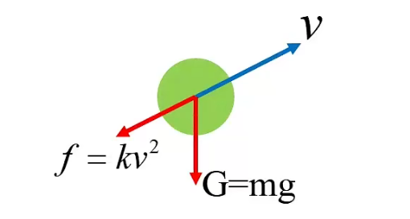
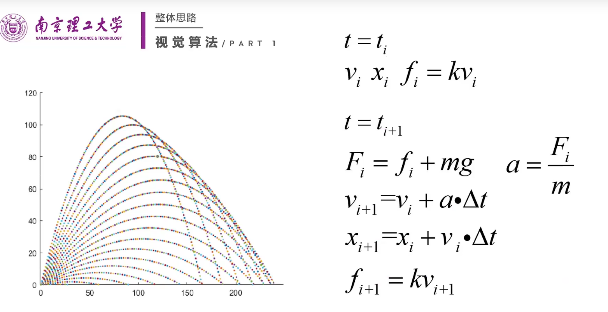
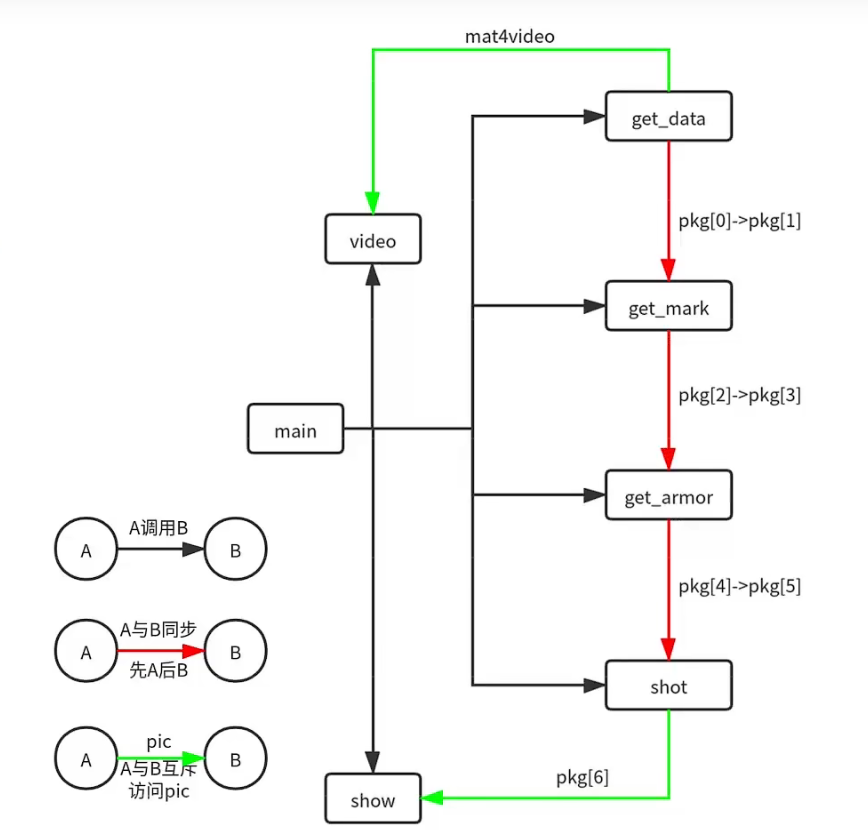
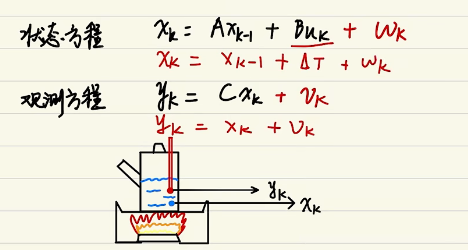
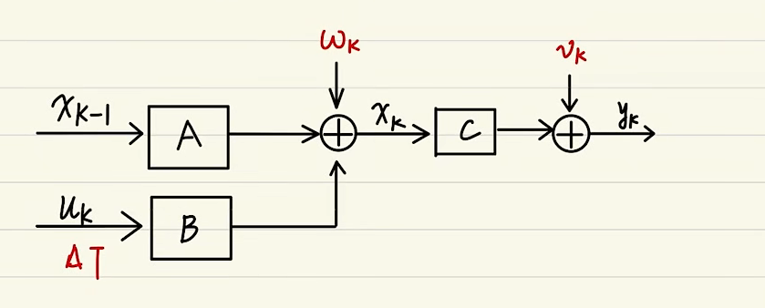

# 整理基础

## 平台选择

### 主机

|     机型     |       说明        |                      特点                      |          价格           |
| :----------: | :---------------: | :--------------------------------------------: | :---------------------: |
|     NUC      | Intel自家的minipc |               高CPU 低GPU 体积小               |       1000~3000+        |
| 第三方minipc | 类似NUC 体积更小  |             CPU同NUC GPU 成本偏高              |                         |
|    工控机    |   低成本高收益    |                    CPU较低                     |                         |
|  Jetson TX2  | 英伟达的计算平台  | 高GPU 低CPU 体积小 需要定制外壳（PCIe G2接口） | 单芯片1599(4G) 3499(8G) |
|   DJI 妙算   |  DJI自家计算平台  |   高GPU（Jetson TX2） 低CPU（低压U）成本最高   |          6999           |

- 成本（工控机3000以内都可以）
- 处理器（i5 8代）
- 内存（一般8G够用）
- 硬盘空间（120G左右够用）

### 相机


## 视觉算法 NUST（装甲板）

- 识别出目标装甲板的
- 预测目标运动
- 计算弹道


- **串口**

  ```cpp
  struct Txpackage
  {
      char head = 0x1f;
      sint pitch;	//对电控的云台调节信号
      sint yaw;
      
      char buff;
  };
  
  struct Rxpackage
  {
      char head = 0xff;
      float pitch;
      float yaw;
      float roll;
      float spd;
      sint color;	//颜色
      sint gryo;
      sint mode;
      float yaw_spd;
      float pitch_spd;
      char tail = 0xfe;
  };
  ```

- **装甲识别**

  - **预处理**

    小光圈：仅过滤自发光，减少反射光干扰

    二值化-轮廓检测

  - **装甲识别**

    - `findContours`

    - 灯条识别

      面积，长宽比符合要求

      `minAreaRect`最小矩形 包围矩形的角度符合范围

    - 灯条匹配

      两灯条平行度在一定范围以内

      距离在一定范围以内

      大小相似

      水平高度差在一定范围

    - CNN数字识别

- **姿态解算**

  ==PNP==

- **预测轨迹**

  ==卡尔曼滤波==

- **弹道解算**

  考虑空气阻力

  

​	



- ==**多线程**==





## 能量机关平面几何（2D）

对于正视的能量机关


通过帧间旋转角度差来计算实时角速度`w`（帧间时差1/30秒，两帧装甲板距离可以近似为旋转弧长）

设弹道时间为`t`，得期间转过的角度为`θ = wt`

`center2target`的向量设为`vector_t(2×1)`，`center2predict`的向量设为`vector_p(2×1)`，有
$$
vector_p = 
\begin{bmatrix}
\cos(\theta)\space-\sin(\theta)\\
\sin(\theta)\space\cos(\theta)
\end{bmatrix}
×vector_t\newline
predict=center+vector_p
$$
（实际应用中需要进行**转置**使矩阵乘法有效，`cv::Point`类型为2×1；同时适用装甲板定点）

参考代码

```cpp
cv::Point2d trans(cv::Point2d point, cv::Point2d& center, double& theta)
{
    cv::Mat R = (cv::Mat_<double>(2, 2) << cos(theta), -sin(theta), sin(theta), cos(theta));	//建立转换的矩阵
    cv::Mat vector_target = (cv::Mat_<double>(2, 1) << point.x - center.x, point.y - center.y);	//建立圆心到目标点的向量
    cv::Mat vector_predict = R * vector_target;
    cv::Point2d predict(vector_predict);	//转换为cv::Point2d类型
    return predict;	//返回，center+predict即为所求
}
```

## 卡尔曼滤波 Kalman Filter

### 入门

**使用系统：线性高斯系统**

- 线性

  - 叠加性：
    $$
    f(a,b) = f(a)+f(b)
    $$
  
  - 齐次性
  
- 高斯：噪声满足正态分布

**宏观意义：滤波即加权**

​	理想状态：信号 × 1 + 噪声 × 0

​		低通滤波：低频信号 + 0 · 高频噪声

​		卡尔曼滤波：k · 估计值 + b · 观测值

### 进阶

**状态空间表达式**

状态方程
$$
x_k=Ax_{k-1}+Bu_k+w_k
$$

- $x_k$：当前状态的值

- $x_{k-1}$：上一状态的值
- $u_k$：输入
- $w_k$：过程噪声，误差
- $A$：状态转移矩阵，将$x_{k-1}$的值作用到$x_k$

观测方程
$$
y_k=Cx_k+v_k
$$

- $y_k$：观测值
- $x_k$：状态值
- $v_k$：观测噪声，误差





从上一时刻状态值和输入到下一时刻观测值的过程，其中A、B、C就是对应的变化关系

**参数分析**

$w_k$、$v_k$均符合高斯分布，称高斯白噪声

- $w_k\in N(0;Q_k)$
- $v_k\in N(0;R_k)$

> *exp*：
>
> ​	GPS -> Position
>
> ​	1000m $\pm\space\delta$m（噪声）$v_k=\delta$m
>

**方差**

一维方差

- 噪声方差（$Q_k,R_k$）
- 状态方差（$\widehat{x}_{k^-}$）

二维方差
$$
\widehat{x}_{k}^-=
\begin{bmatrix}
\widehat{x}_{k_1}^-\\
\widehat{x}_{k_2}^-
\end{bmatrix}
->
\begin{bmatrix}
{w}_{k_1}\\
{w}_{k_2}
\end{bmatrix}
$$

- 协方差**

$$
cov(\widehat{x}_{k_1}^-,\widehat{x}_{k_2}^-)=
\begin{bmatrix}
cov(x_1,x_1)\ cov(x_1,x_2)\\
cov(x_2,x_1)\ cov(x_2,x_2)\\
\end{bmatrix}
$$

### 放弃

**卡尔曼公式理解**

实现过程：使用上一次的最优结果预测当前的值，同时使用**观测值修正当前值**，得到最优结果
$$
预测\newline
\widehat{x}_t^-=F\widehat{x}_{t-1}+Bu_{t-1}+w_k\newline
P_t^-=FP_{t-1}F^T+Q\newline
更新\newline
K_t=P_t^-H^T(HP_t^-H^T+R)^{-1}\newline
\widehat{x}_t=\widehat{x}_t^-+K_t(z_t-H\widehat{x}_t^-)\newline
P_t=(I-K_tH)P_t^-
$$

- **预测模型**

1. 先验估计 $ \widehat{x}_t^-=F\widehat{x}_{t-1}+Bu_{t-1}+w_k$
   根据上一时刻的最有估计，得到当前时刻的先验估计值

>对于一个匀速直线运动物体
> 
>设其位置为p，当前速度为v，组成状态$x_t=\begin{bmatrix}p\\v\end{bmatrix}$
> $$
>\begin{bmatrix}p_i=p_{i-1}+v_{i-1}\cdot\Delta t-\frac{a}{2}\Delta t^2  \\
> v_i=v_{i-1}+a\cdot\Delta t
> \end{bmatrix}=>\newline
> $$
> 
> $$
> \begin{bmatrix}p_i\\v_i\end{bmatrix}=\begin{bmatrix}1\ \Delta t\\0 \ 	1\end{bmatrix}\begin{bmatrix}p_{i-1}\\v_{i-1}\end{bmatrix}+
>\begin{bmatrix}\frac{\Delta t^2}{2}\\\Delta t\end{bmatrix}a_i
> $$
> 
> $$
> \widehat{x}_t^-\space\space=\space\space F\space\space\space\widehat{x}_{t-1}\space\space\space+\space\space B\space\space\space u_{t-1}
>$$
> 

2. 先验估计协方差 $P_t^-=FP_{t-1}F^T+Q$
   根据上一时刻的协方差矩阵得到当前时刻的协方差矩阵

> $$
> cov(x,x)=Var(x)\newline
> cov(Ax,Ax)=Acov(x,x)A^T\newline
> cov(Ax+k,Ax+k)=cov(Ax,Ax)
> $$
>
> $$
> P_t^-=cov(\widehat{x}_t^-,\widehat{x}_t^-)=cov(F\widehat{x}_{t-1}+Bu_{t-1}+w_k,F\widehat{x}_{t-1}+Bu_{t-1}+w_k)\newline
> =Fcov(\widehat{x}_{t-1},\widehat{x}_{t-1})F^T+cov(w_k,w_k)
> $$

- **测量模型**

3. 测量方程 $z_t=Hx_t+v$

> $$
> \begin{bmatrix}z_p=p_t-\Delta p_t  \\
> z_v=0
> \end{bmatrix}=>\newline
> $$
>
> $$
> \begin{bmatrix}z_p\\z_v\end{bmatrix}=\begin{bmatrix} 1 \ 0 \end{bmatrix}\begin{bmatrix}p_{t}\\v_{t}\end{bmatrix}+\begin{bmatrix} 1 \ 0 \end{bmatrix}
> \begin{bmatrix}\Delta p_t\\\Delta v_t\end{bmatrix}
> $$
>
> $$
> \space\space\space\space\space\space\space\space\space\space\space\space\space\space\space\space\space\space\space\space\space\space\space\space\space\space\space\space\space\space\space\space\space z_t\space\space=\space\space H\space\space\space x_t\space\space\space+\space\space v\space(z_t的维数不一定和\widehat{x}_t^-相同)
> $$
>

- **状态更新**

4. 更新卡尔曼增益 $K_t=P_t^-H^T(HP_t^-H^T+R)^{-1}$
5. 修正估计 $\widehat{x}_t=\widehat{x}_t^-+K_t(z_t-H\widehat{x}_t^-)$（最后滤波结果）
   根据估计值和观测值，得到最优估计
6. 更新后验估计协方差 $P_t=(I-K_tH)P_t^-$

**调节超参数**

- $Q$与$R$的取值
  $$
  \begin{matrix}
  P_t^-=FP_{t-1}F^T+Q\\
  K=P_t^-H^T(HP_t^-H^T+R)^{-1}
  \end{matrix}
  ==>
  K=(P_{t-1}+Q)(P_{t-1}+Q+R)^{-1}\newline
  $$

  $$
  \widehat{x}_t=\widehat{x}_t^-+K(z_t-H\widehat{x}_t^-)
  $$

  如果通过传感器得到的数据比较精准，观测值占权重较大，需要将$K$增大，即$P_{t-1}+Q$增大，或者$P_{t-1}+Q+R$减小，可以使$R$减小

  如果运动模型理想，$K$减小，$R$增大，$Q$减小


  $Q$对应过程噪声的方差，对于理想模型，基本没有过程噪声，$Q$可以取小；反之$Q$取大

  $R$对应观测噪声的方差，对于精密的传感器，$R$可以减小；反正$R$取大

- $p_0$与$\widehat{x}_0$的取值

  $p_0$与$\widehat{x}_0$的取值的取值比较随意

  $\widehat{x}_0$经过几次迭代之后值趋于稳定，习惯取0

  $p_0$取较小值，方便收敛（一般为1，不可取0）

**卡尔曼滤波的使用**

1. 选择状态量、观测量
2. 构建方差
3. 初始换参数
4. 带入公式迭代
5. 调节超参数

### 精通
